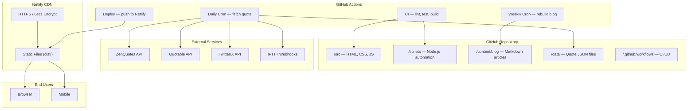
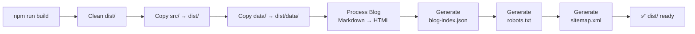
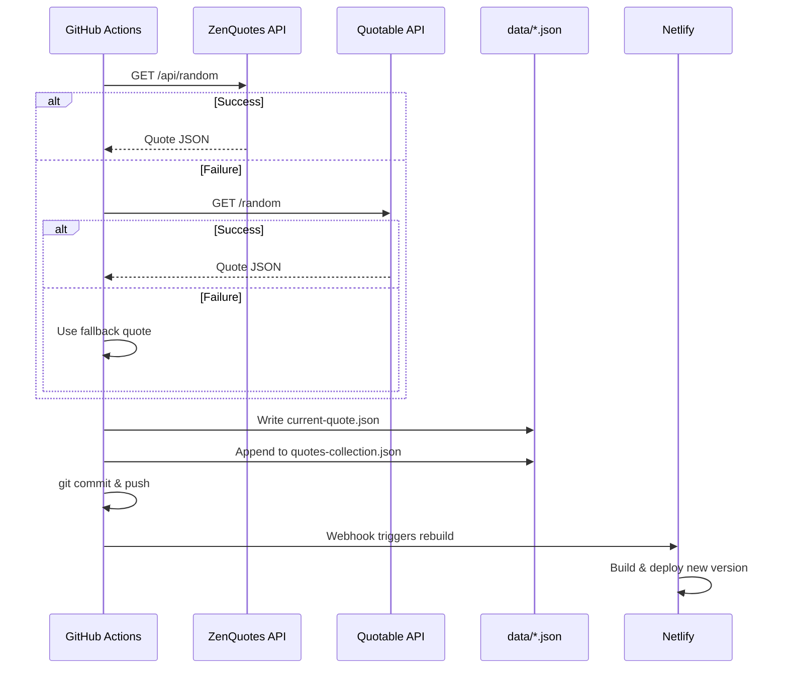

# Technical Architecture — DailyLift

## 1. Architecture Overview

DailyLift uses a **Jamstack architecture** — static HTML served from a CDN with content generated at build time and automation handled by GitHub Actions.



## 2. Directory Structure

```
dailylift/
├── .github/
│   └── workflows/
│       ├── ci.yml              # Lint, test, build on push/PR
│       ├── deploy.yml          # Build & deploy to Netlify
│       ├── update-content.yml  # Daily quote fetch cron
│       └── weekly-blog.yml    # Weekly blog rebuild cron
├── content/
│   └── blog/                  # Markdown articles (10+)
├── data/
│   ├── current-quote.json     # Today's quote
│   └── quotes-collection.json # Accumulated quotes (50+)
├── docs/                      # Project documentation
├── scripts/
│   ├── build.js               # Main build pipeline
│   ├── fetch-quote.js         # API quote fetcher
│   ├── generate-sitemap.js    # Sitemap XML generator
│   ├── lint-check.js          # Lightweight lint validator
│   └── post-social.js         # Social media poster
├── src/
│   ├── css/style.css          # Design system
│   ├── js/app.js              # Main application logic
│   ├── tools/
│   │   ├── bill-splitter.js   # Bill Splitter tool
│   │   ├── bmi-calculator.js  # BMI Calculator tool
│   │   └── unit-converter.js  # Unit Converter tool
│   ├── index.html             # Homepage
│   ├── tools.html             # Tools page
│   ├── blog.html              # Blog listing
│   └── about.html             # About page
├── tests/                     # Jest test suite (9 files, 150+ tests)
├── Dockerfile                 # Node 18 Alpine container
├── docker-compose.yml         # Service definitions
├── run.ps1                    # PowerShell run script
├── run.sh                     # Bash run script
├── netlify.toml               # Netlify deployment config
└── package.json               # Dependencies & scripts
```

## 3. Build Pipeline



### Build Steps Detail
1. **Clean** — removes existing `dist/` directory
2. **Copy source** — copies all `src/` files (HTML, CSS, JS) to `dist/`
3. **Copy data** — copies `data/` directory to `dist/data/`
4. **Blog processing** — reads Markdown files from `content/blog/`, parses YAML frontmatter with `gray-matter`, converts to HTML with `marked`, injects into post template
5. **Blog index** — generates `blog-index.json` for client-side blog listing
6. **robots.txt** — writes crawler directives and sitemap reference
7. **Sitemap** — scans `dist/` for all HTML files, generates XML with priorities

## 4. Automation Flows

### 4.1 Daily Quote Update


### 4.2 CI Pipeline
```
Push/PR → Lint → Test (95% coverage gate) → Build → Verify artifacts → Deploy
```

## 5. Technology Stack

| Layer | Technology | Purpose |
|-------|-----------|---------|
| Frontend | HTML5, CSS3, Vanilla JS | No framework overhead |
| Fonts | Google Fonts (Inter, Outfit) | Premium typography |
| CSS | Custom properties, CSS Grid, Flexbox | Design system |
| Build | Node.js 18 | Scripts and Markdown processing |
| Markdown | marked + gray-matter | Blog content pipeline |
| PDF | pdf-lib (CDN) | Client-side PDF generation |
| Testing | Jest + jsdom + cheerio | Unit/integration/E2E tests |
| CI/CD | GitHub Actions | Automated pipelines |
| Containerization | Docker (Alpine) | Reproducible environment |
| Hosting | Netlify (free tier) | CDN, HTTPS, auto-deploy |
| APIs | ZenQuotes, Quotable | Daily quote content |
| Social | Twitter API v2, IFTTT | Automated posting |

## 6. Data Flow

### Quote Data
```
ZenQuotes API → fetch-quote.js → current-quote.json → build.js → dist/data/ → app.js → DOM
                                → quotes-collection.json → PDF generator (client-side)
```

### Blog Data
```
content/blog/*.md → build.js (gray-matter + marked) → dist/blog/*.html
                                                     → dist/data/blog-index.json → app.js → DOM
```

## 7. Security Model

- **No server-side code** — eliminates server-side vulnerabilities
- **No user data collection** — all tools run client-side
- **API secrets** stored exclusively in GitHub Secrets
- **Security headers** enforced via `netlify.toml`
- **HTTPS** via Let's Encrypt, auto-renewed by Netlify
- **Dependency scanning** via GitHub Dependabot
